# Azure Databricks CI/CD pipeline using Azure DevOps

Throughout the Development lifecycle of an application, [CI/CD](#) is a [DevOps](/en/tag/devops) process enforcing automation in building, testing and desploying applications. Development and Operation teams can leverage the advantages of CI/CD to deliver more frequently and reliably releases in a timly manner while ensuring quick iterations.

CI/CD is becoming a necessary process for data engineering and data science teams to deliver valuable data project and increase confidence in the quality of the outcomes. With [Azure Databricks](https://azure.microsoft.com/en-gb/services/databricks/) you can use solutions like Azure DevOps, Gitlabs, Github Actions or Jenkins to build a CI/CD pipeline to reliably build, test, and deploy your notebooks and libraries.

In this article we will guide you step by step to create an effective CI/CD pipeline using Azure Devop to deploy a simple notebook and a library to Azure Databricks. We will show how to manage sensitive data during the process using [Azure Keyvault]() and how to secure the communication between Azure Databricks and our object storage.

## Description of our pipeline

Our stack:
- An Azure Databricks workspace
- Azure Devops: to build, test and deploy our artifacts (notebook and library) to Azure Databricks
- Azure Data Lake Storage Service: To store our dataset that will be consumed by Azure Databricks
- Azure Key vault: to store sensitive data


## Prerequisites


1. An Azure Account and an active subscription. You can create a free account [here]().
2. Azure Devops Organization that will hold a project for our repository and our pipeline assets

Clone the repository

```sh
git clone https://github.com/bngom/azure-databricks-cicd.git && cd azure-databricks-cicd
```

Create a python environment and install dependencies

```sh
python -m venv dbcicd
```

Activate the virtual environment

```sh
source dbcicd/bin/activate
```

Install requirements

```sh
pip install -r requirements.txt
```

Run lint test

```sh
python -m pip install flake8
flake8 ./test/ ./src/
```

Run unit test:

```sh
python -m test
```

Build your library: in `./src` folder we have a simple library with few functionalities:
- Load our dataset
- Save the dataset as parquet
- Create a table

```sh
# python3 -m pip install --upgrade build
# python3 -m build
```

## Setting up Azure CLI

You can use [Azure Cloud Shell]() from the directry you would like to deploy your resources. You can install [Azure CLI]() to perform the same task.

To [install Azure CLI](https://docs.microsoft.com/fr-fr/cli/azure/install-azure-cli-linux?pivots=apt)

```sh
curl -sL https://aka.ms/InstallAzureCLIDeb | sudo bash
```

Configure Azure CLI, your default browser will prompt for you to enter your credentials. This will connect you to your default tenant.

```sh
az login
```

Get details about your account. 

```sh
az account show
```

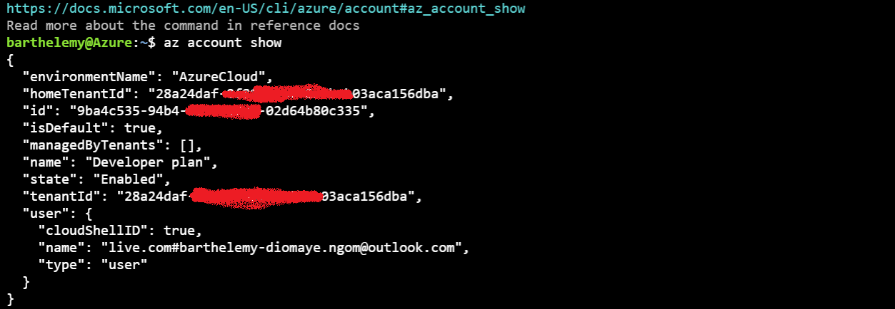

You can now if you wish connect to another directory by specifying the `tenant_id` .

```sh
az login --tenant <TENANT ID>
```

### Prerequisites for Azure

In our selected directory let us create a resource Group

```sh
az group create --name datatabricks-rg --location francecentral
```

With the command above, we test the deployment of our Azure Resource Management template against the resource group. This will only validate your template. The deployment will be done during the build phase in azure devops.

```sh
cd template
az deployment group what-if --name TestDeployment --resource-group databricks-rg --template-file dbx.template.json --parameters @dbx.parameters.json
```

## Setting up Azure DevOps

In this section we will create a Azure DevOps organization, create a project and upload our repository. We will set up an Azure Resource Manager connection in Azure Devops to authorize communication between Azure DevOps and the Azure Resource Manager. 

1. Go to dev.azure.com

2. [Create an Azure DevOps Organization](https://docs.microsoft.com/en-us/azure/devops/organizations/accounts/create-organization?view=azure-devops)

- Click on *New organization*, then click on Continue


- Set the name of your Azure DevOps organization, then click on Continue.


3. [Create a Project in your Azure DevOps Organisation](https://docs.microsoft.com/en-us/azure/devops/organizations/projects/create-project?view=azure-devops&tabs=preview-page)

- In your new organization, set your project name then click on *Create project*


4. Import a repository

- Click on *Repo*, then on *Import repository*


5. Set an Azure Resource Manager connection

- Project Settings > Pipeline : Service connections > Create service connections


- Select Azure Resource Manager


- Select *Service principal (automatique)*


- Select your subscription and the resource group `databricks-rg` created previously and save.


### Create a Build Pipeline

We are all set to create a Build pipeline. This operation will generate artifacts to be consumed in our release pipeline.

- Pipeline > Pipeline: CLick on Create pipeline
- Select *Azure GIt Repo*
- Select your repository
- Select *Python package*

The `azure-pipelines.yml` file in your repository is automatically detected. The build pipeline is composed of steps that include tasks and scripts to be executed againts different python version. The pipeline will first install all requirements and run unit test. If succeeded it will publish an ARM template and a notebook artifacts, then build a python library and publish it. There is also a task involving test coverage evaluation.

```yaml
# azure-pipelines.yml
trigger:
- dev

pool:
  vmImage: ubuntu-latest
strategy:
  matrix:
    Python36:
      python.version: '3.6'
    Python37:
      python.version: '3.7'
    Python38:
      python.version: '3.8'

variables:
- name: notebook-name
  value: friends-notebook

steps:
- task: UsePythonVersion@0
  inputs:
    versionSpec: '$(python.version)'
  displayName: 'Use Python $(python.version)'
- script: |
    python -m pip install --upgrade pip setuptools wheel
    pip install -r requirements.txt
  displayName: 'Install dependencies'
- script: |
    python -m pip install flake8
    flake8 ./src/
  displayName: 'Run lint tests'
- script: |
    python -m pip install pytest pytest-azurepipeline
    pytest test --doctest-modules --junitxml=junit/test-results.xml --cov=./src --cov-report=xml --cov-report=html
  displayName: 'Test with pytest'
- task: PublishTestResults@2
  condition: succeededOrFailed()
  inputs:
   testResultsFiles: '**/test-*.xml'
   testRunTitle: 'Publish test results for Python $(python.version)'
- task: PublishCodeCoverageResults@1
  inputs:
   codeCoverageTool: Cobertura
   summaryFileLocation: '$(System.DefaultWorkingDirectory)/**/coverage.xml'
   reportDirectory: '$(System.DefaultWorkingDirectory)/**/htmlcov'
- bash: |
    mkdir -p "$(Build.ArtifactStagingDirectory)/template"
    cp template/dbx.parameters.json template/dbx.template.json "$(Build.ArtifactStagingDirectory)/template/"
  displayName: 'ARM template Build Artifacts'
- bash: |
    mkdir -p "$(Build.ArtifactStagingDirectory)/notebook"
    cp notebook/$(notebook-name).py "$(Build.ArtifactStagingDirectory)/notebook/$(notebook-name)-$(Build.SourceVersion).py"
  displayName: 'Notebook Build Artifacts'
- task: PublishBuildArtifacts@1
  displayName: Publish ARM Template Build Artifacts
  inputs:
    pathtoPublish: '$(Build.ArtifactStagingDirectory)/template'
    artifactName: template
- task: PublishBuildArtifacts@1
  displayName: Publish Notebook Build Artifacts
  inputs:
    pathtoPublish: '$(Build.ArtifactStagingDirectory)/notebook'
    artifactName: notebook
- script: |
    mkdir -p "$(Build.ArtifactStagingDirectory)/wheel"
    python3 -m pip install --upgrade build
    python3 -m build
    cp dist/friends-0.0.1-py3-none-any.whl "$(Build.ArtifactStagingDirectory)/wheel/friends-0.0.1-py3-none-any.whl"
  displayName: 'Copy wheel artifact'
- task: PublishBuildArtifacts@1
  displayName: Publish Wheel Build Artifacts
  inputs:
    pathtoPublish: '$(Build.ArtifactStagingDirectory)/wheel'
    artifactName: wheel
```

Now you can run your build pipeline.


The build pipeline executed successfully and artifacts are generated and ready to be consumed in a release pipelie.


Before Creating a release pipeline let us do some configuration in azure devops. For security purpose, we have dummy varibale in our template parameter file `dbx.parameters.json`. We will use a *variable group* and overwrite them in our release pipeline.

Create Variable Group:

- Pipeline > Library > +Variable Group


- Create the following variables, and save


### Create a Release Pipeline

**PHASE 1**

In this section we will create a release to deploy resources (Databricks workspace, KeyVault, Storage Account and Container for blob storage) on Microsoft Azure.

- Pipelines > Release: +New Piepline
- On the right blade, For *select a template* click on *Empty Job*


- Update the Stage name to *Development*


- Click on *Add artifacts* and Select the source build pipeline `demo-cicd`. The click on *Add*


- Click on *variable* and link our Variable Group to stage *Development*


- Now, click on  *Task*:

  - Check the Agent job set up: make sure the Agent Specification is set to `ubuntu-20.04`
  - Clic on + sign near Agent job 


  - Add ARM Resource Deployment and configure it accordingly giving the template and parameter files. And overwriting the variables:

    - `Deployment scope`: Resource Group
    - `Resource manager connection`: Select your Azure Resource manager connection and click on *Authorize*
    - `Subscription`: Select your subscription
    - `Action`: Create or update resource group
    - `Resource group`: select the resource group created previously or use the variable $(rg_name)
    - `Location`: idem, or $(location)
    - `Template`: Click on `more` and select `dbx.template.json` in the template artifacts
    - `Template parameters`: select `dbx.parameters.json`in the template artifacts
    - `Override template parameter`: Update tha values of the parameters with the variables we created in our variable group.

       

      Or you can copy past the below lines of code

      ```sh
      -objectId $(object_id) -keyvaultName $(keyvault) -location $(location) -storageAccountName $(sa_name) -containerName $(container) -workspaceName $(workspace) -workspaceLocation $(location) -tier "premium" -sku "Standard" -tenant $(tenant_id) -networkAcls {"defaultAction":"Allow","bypass":"AzureServices","virtualNetworkRules":[],"ipRules":[]}
      ```
    - Deployment mode: Incremental
    - Now, save your configuration

    

We are ready now to create a first release

- Click on the button: *Create release*


- Stages for a trigger change from automated to manual: select *Development*


- Click on *create*
- Go to Pipelines > Release
- Select our release pipeline 


- Click on the newly created release


- Click on deploy


Our pipeline executed successfully


And our resources are deployed in Azure. Go to Azure Portal and check


**PHASE 2**

We will complete the deployment of our release pipeline but for security concerns, let us do some more configurations.

**Generate Databricks Token**

Log into the Databricks Workspace and under User settings (icon in the top right corner) and select “Generate New Token”. Choose a descriptive name and copy the token to a notebook or clipboard. The token is displayed just once; you can create as many tokens as you wish.

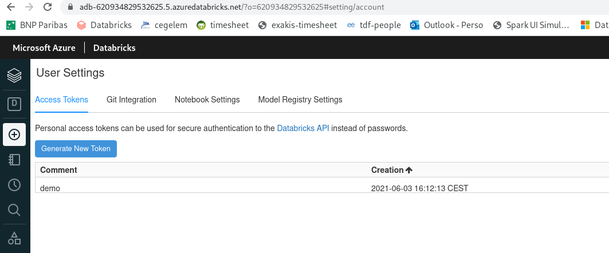

Launch your Databricks workspace and generate an Access Token. Generate a databricks token [here](https://docs.databricks.com/dev-tools/api/latest/authentication.html#generate-a-personal-access-token). Make sure to copy your token you will need it for the next step

The following command show you how to copy the new token and save it into your keyvault. At the same tiime we will save the URI of our Databricks service, you can find this one in Azure portal.

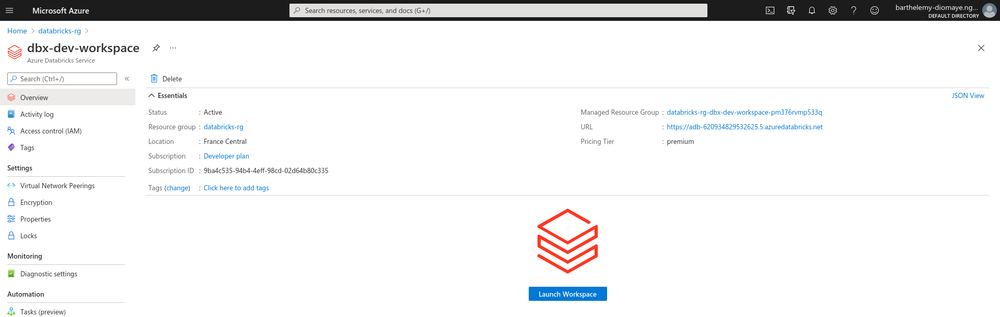

Make sure that for Git integration, the git provider is set to `Azure DevOps Service`

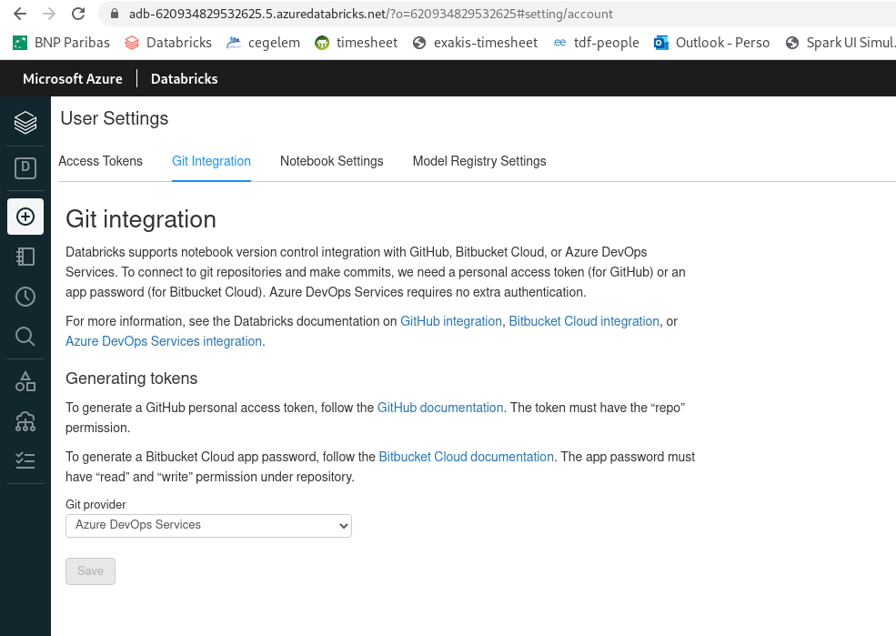

```sh
dbxtoken="your databricks token"
dbxuri="https://adb-<workspace-id>.<random-number>.azuredatabricks.net"
az keyvault secret set --vault-name $keyvault_name --name "dbxtoken" --value $dbxtoken
az keyvault secret set --vault-name $keyvault_name --name "dbxuri" --value $dbxuri
```

Generate a shared access signature token for the storage account. This will secure the communication between Azure Databricks and the object storage.

```sh
a_name="dbxbnsa"
keyvault_name="dbx-bn-keyvault"
end=`date -u -d "10080 minutes" '+%Y-%m-%dT%H:%MZ'`
az storage account generate-sas \
  --permissions lruwap \
  --account-name $sa_name \
  --services b \
  --resource-types sco \
  --expiry $end \
  -o json
```

Your SAS Token is generated, copy the generated SAS token, copy it with the storage account and the container name the key vault.

```sh
sastoken="YOUR-KEYVAULT-SAS-TOKEN"
sa_name="YOUR-STORAGE-ACCOUNT-NAME"
container="YOUR-CONTAINER-NAME"
az keyvault secret set --vault-name $keyvault_name --name "storagerw" --value $sastoken
az keyvault secret set --vault-name $keyvault_name --name "storageaccount" --value $sa_name
az keyvault secret set --vault-name $keyvault_name --name "container" --value $container
```

List your secrets

```sh
az keyvault secret list --vault-name $keyvault_name --output table
```

**Configure Databricks CLI**

Install Databricks cli [here](https://docs.databricks.com/dev-tools/cli/index.html)

```sh
pip install databricks-cli
```

Configure your cli to interact with databricks. You will need to enter the uri and the token generated

```sh
databricks configure --token <<EOF
https://adb-<workspace-id>.<random-number>.azuredatabricks.net
YOUR-DATABRICKS-TOKEN
EOF
```

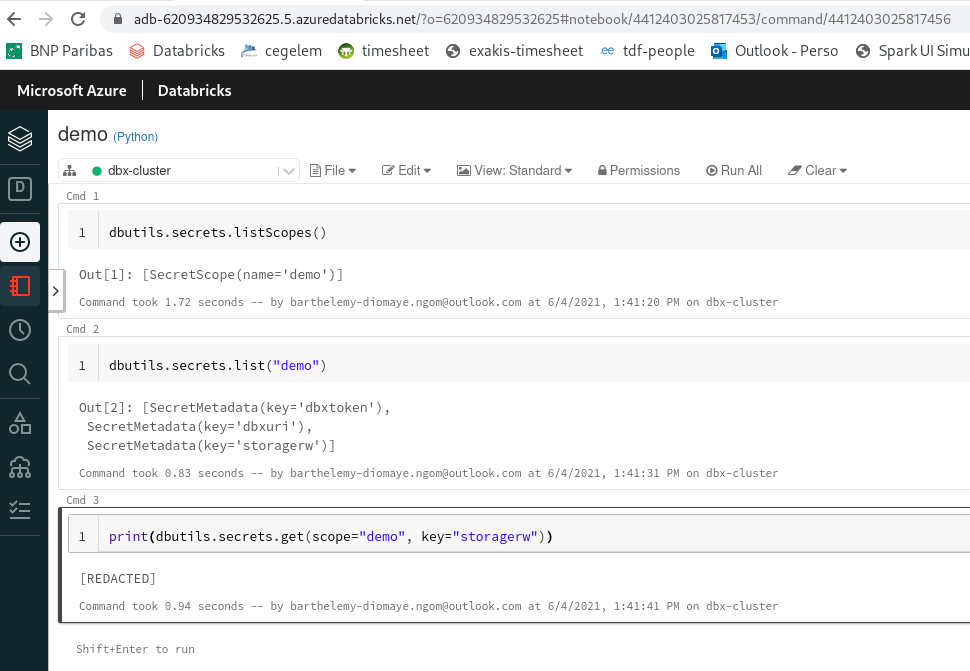

**Create a cluster in databricks**

Once the connection is established, we can create a cluster in databricks

```sh
rm -f create-cluster.json
cat <<EOF >> create-cluster.json
{
  "num_workers": null,
  "autoscale": {
      "min_workers": 2,
      "max_workers": 8
  },
  "cluster_name": "dbx-cluster",
  "spark_version": "8.2.x-scala2.12",
  "spark_conf": {},
  "azure_attributes": {
      "first_on_demand": 1,
      "availability": "ON_DEMAND_AZURE",
      "spot_bid_max_price": -1
  },
  "node_type_id": "Standard_DS3_v2",
  "ssh_public_keys": [],
  "custom_tags": {},
  "spark_env_vars": {
      "PYSPARK_PYTHON": "/databricks/python3/bin/python3"
  },
  "autotermination_minutes": 30,
  "cluster_source": "UI",
  "init_scripts": []
}
EOF

databricks clusters create --json-file create-cluster.json
# cluster_id=0603-150336-yuck781
# az keyvault secret set --vault-name $keyvault_name --name "cluster_id" --value $cluster_id
# Get my key vault id to be used as reference in my arm template parameter's file
#`az keyvault list | jq '.[].id'

```

**Create an Azure Key Vault-backed secret scope in Databricks**

Get the resource ID and the DNS name from your key vault properties and create a secret scope in Azure Databricks.

```sh
vaultUri=$(az keyvault show --name $keyvault_name | jq '.properties.vaultUri')
vaultId=$(az keyvault show --name $keyvault_name | jq '.id')
databricks secrets create-scope --scope demo --scope-backend-type AZURE_KEYVAULT --resource-id $vaultId --dns-name $vaultUri
# List the scope(s)
databricks secrets list-scopes
```
> If the above command raise an error, you can still create the scope from the databricks workspace using the following url `https://<databricks-instance>#secrets/createScope`.


Upload the following notebook into your workspace and test if you can securely access the dataset uploaded in the storage account.

```sh
cat <<EOF >> demo.py
# Databricks notebook source
dbutils.secrets.listScopes()

# COMMAND ----------

dbutils.secrets.list("demo")

# COMMAND ----------

print(dbutils.secrets.get(scope="demo", key="storagerw"))

# COMMAND ----------

# Unmount directory if previously mounted.
MOUNTPOINT = "/mnt/commonfiles"
if MOUNTPOINT in [mnt.mountPoint for mnt in dbutils.fs.mounts()]:
  dbutils.fs.unmount(MOUNTPOINT)

# Add the Storage Account, Container, and reference the secret to pass the SAS Token
STORAGE_ACCOUNT = dbutils.secrets.get(scope="demo", key="storageaccount")
CONTAINER = dbutils.secrets.get(scope="demo", key="container")
SASTOKEN = dbutils.secrets.get(scope="demo", key="storagerw")
SOURCE = "wasbs://{container}@{storage_acct}.blob.core.windows.net/".format(container=CONTAINER, storage_acct=STORAGE_ACCOUNT)
URI = "fs.azure.sas.{container}.{storage_acct}.blob.core.windows.net".format(container=CONTAINER, storage_acct=STORAGE_ACCOUNT)

try:
  dbutils.fs.mount(
    source=SOURCE,
    mount_point=MOUNTPOINT,
    extra_configs={URI:SASTOKEN})
except Exception as e:
  if "Directory already mounted" in str(e):
    pass # Ignore error if already mounted.
  else:
    raise e

display(dbutils.fs.ls(MOUNTPOINT))

# COMMAND ----------

friendsDF = (spark.read
              .option("header", True)
              .option("inferSchema", True)
              .csv(MOUNTPOINT + "/friends.csv"))

display(friendsDF)
EOF
```

**Release Pipeline: continue**

Let's first create a new variable group and link it this time with our azure keyvault.

- Go to Pipelines > Library
- Click on *Variable* and add a new variable group
- Toggle `Link secrets from an Azure vault as variables`
- Select your subscription
- Select the key vault name
- Add variables from your keyvault

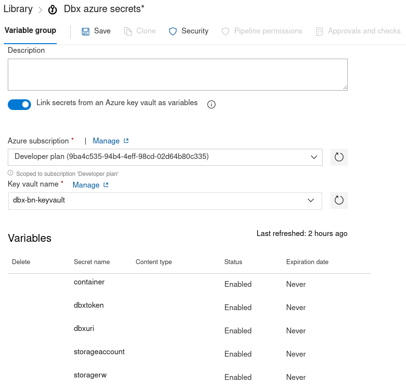

> ADD Screen for Notebook info 

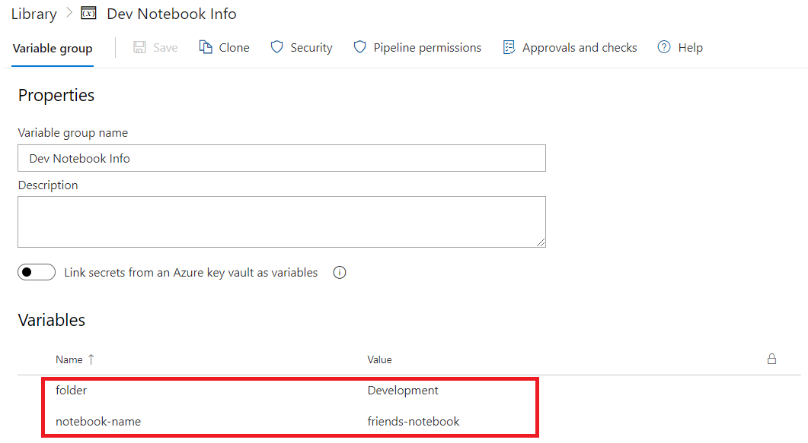

- Go to Pipelines > Release: Select our pipeline and Edit the pipeline.
- Link the variable group to Release scope

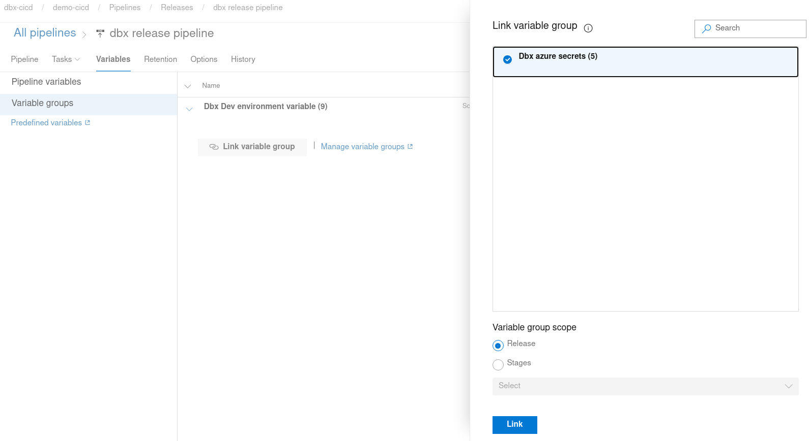

Now we are ready to update our tasks

- Go to Tasks
- Add `UsePythonVersion` task. **Put it above the `AzureResourceManagerTemplateDeployment`**

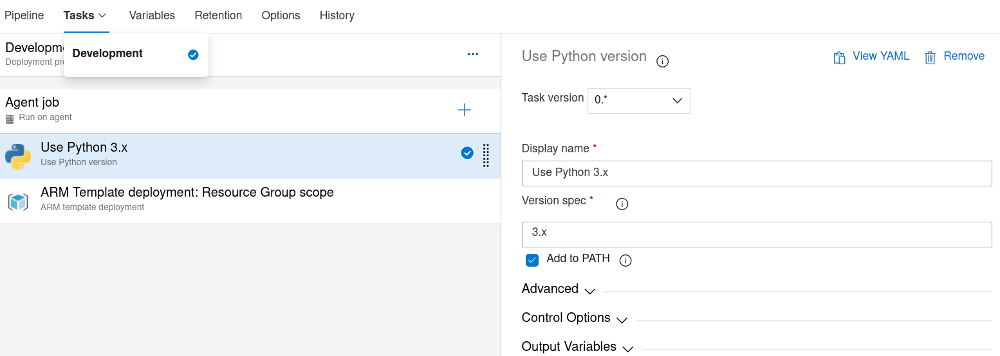

- After `AzureResourceManagerTemplateDeployment` task add a Bash script

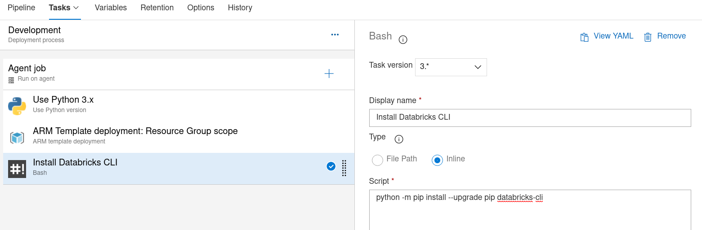

- Add a bash task; Rename it to `Databricks configure` and add the following code in the Inline Script.
```sh
databricks configure --token <<EOF
https://adb-<workspace-id>.<random-number>.azuredatabricks.net
$(dbxtoken)
EOF
```
- Add a Bash task; Rename it to `Import notebook into databricks` and add the following code in the Inline Script.
```sh
databricks workspace mkdirs /$(folder)
databricks workspace import --language PYTHON --format SOURCE --overwrite _demo-cicd/notebook/$(notebook-name)-$(Build.SourceVersion).py /$(folder)/$(notebook-name)-$(Build.SourceVersion).py
```
- Add a Bash task; Rename it to `Import library into databricks` and add the following code in the Inline Script.
```sh
# create a new directory
databricks fs mkdirs dbfs:/dbx-library
# Import the module
databricks fs rm _demo-cicd//wheel/friends-0.0.1-py3-none-any.whl
databricks fs cp _demo-cicd/wheel/friends-0.0.1-py3-none-any.whl dbfs:/dbx-library/

```
- Add a Bash task; Rename it to `Install Library and attach it to the cluster` and add the following code in the Inline Script.
```sh
cluster_id=$(databricks clusters list --output JSON | jq '[ .clusters[] | { name: .cluster_name, id: .cluster_id, state: .state } ]' | jq '.[] | select(.name=="dbx-cluster")' | jq -r '.id')
# The above query have to be adapted if there is more than one cluster with the same name. They will be in different states.

echo "Cluster id: $cluster_id"

# Install library
databricks libraries install --cluster-id 0604-114001-cokes726 --whl dbfs:/dbx-library/friends-0.0.1-py3-none-any.whl
```

Our tasks will end up to look like this

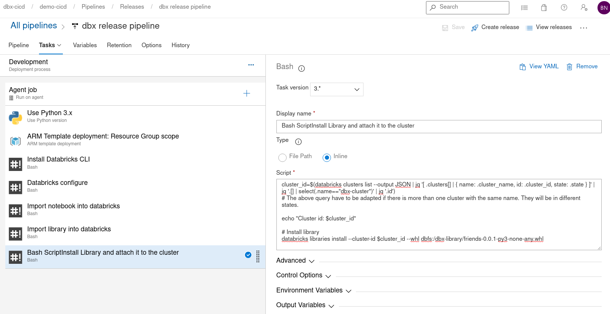

- Save our tasks and Create a release pipeline.
- Make sure your Databricks cluster is in `RUNNING` state
- Then, Deploy the release

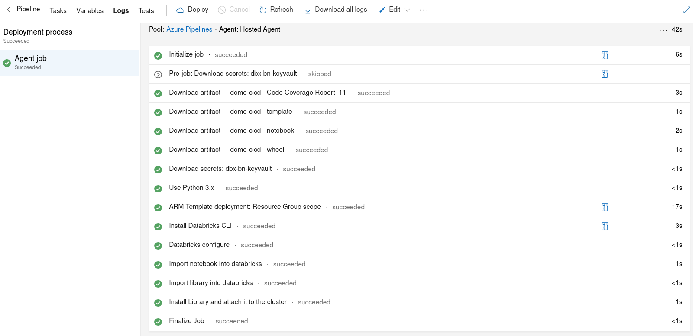

Our Notebook is deployed

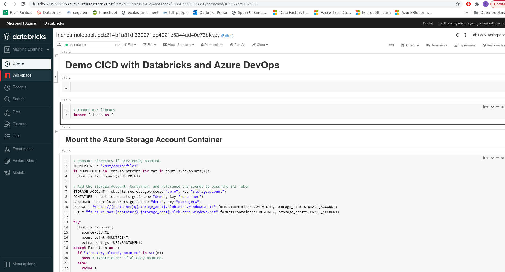

Our library is imported and installed on our cluster

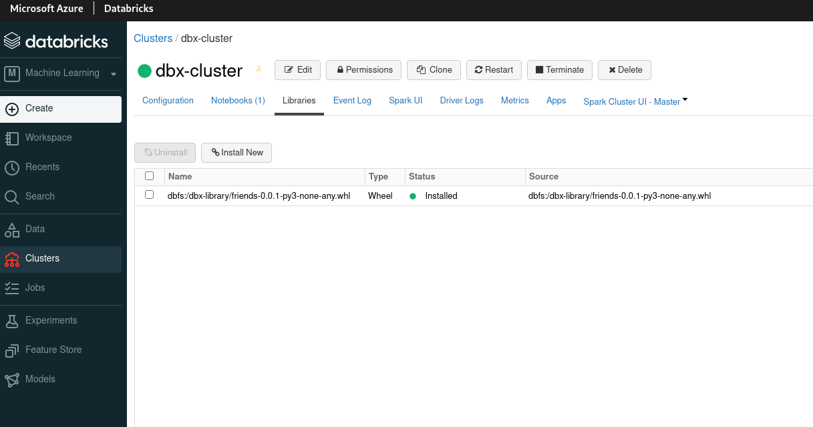

We are now ready to make play in our workspace


